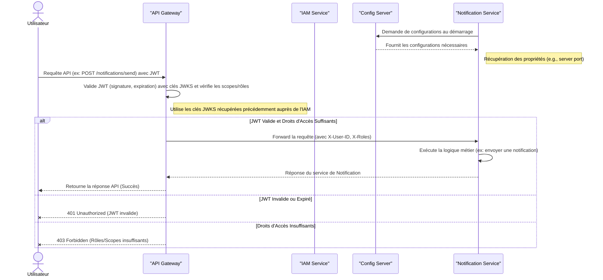

# amcloud-notification

## Description
amcloud-notification is the Notification microservice for the amcloud-platform ecosystem.  
It handles sending notifications to users, enabling seamless integration with other microservices.

## Prerequisites

- Java JDK 17 or higher
- Maven 3.9+
- [Optional] Docker (for deployment)
- Git

## Repository Structure

```
amcloud-notification/
├── backend/                      # Main Spring Boot Notification source code
│   ├── src/
│   │   ├── main/
│   │   │   ├── java/cm/amcloud/platform/notification/
│   │   │   │   ├── config/       # Configuration classes
│   │   │   │   ├── service/      # Business logic and service layer
│   │   │   │   ├── controller/   # REST API controllers
│   │   │   │   ├── dto/          # Data Transfer Objects
│   │   │   │   ├── model/        # Notification models
│   │   ├── resources/            # Application resources (e.g., .env)
│   │   │   ├── application.yml   # Spring Boot configuration
│   │   │   ├── application.properties # Additional properties
│   │   ├── test/                 # Unit and integration tests
│   ├── pom.xml                   # Maven configuration file
│   ├── Dockerfile                # Docker configuration for the Notification service
│   ├── mvnw                      # Maven wrapper script (Linux/Mac)
│   ├── mvnw.cmd                  # Maven wrapper script (Windows)
│   ├── .mvn/                     # Maven wrapper configuration
│   ├── .gitignore                # Git ignore file
│   ├── LICENSE                   # License file
│   ├── README.md                 # Project overview and instructions
├── .github/                      # GitHub workflows, issue templates, etc.
├── docs/                         # Documentation and diagrams
└── README.md
```

## Environment Configuration

A `.env` file **must** be present at the root of `backend/` before running or testing the microservice.  
Example content:

```
# === Notification Service Configuration ===
MAIL_HOST=smtp.gmail.com
MAIL_PORT=587
MAIL_USERNAME=project.in3.uds@gmail.com
MAIL_PASSWORD=xxxx xxxx xxxx xxxx
NOTIFICATION_SERVER_PORT=8085
CONFIG_SERVER_URL=http://localhost:8888

```

> ⚠️ **Never commit sensitive values (tokens, passwords) into the repository.**  
> Use placeholders and configure secrets securely in your deployment environments.

## Installation & Build

```bash
git clone https://github.com/Project-In3-Uds/amcloud-notification.git
cd amcloud-notification/backend
mvn clean install
```

## Running the Microservice

You can start the Notification server with:

```bash
mvn spring-boot:run
```

Or build the JAR and run:

```bash
mvn package
java -jar target/notification-0.0.1-SNAPSHOT.jar
```

## Basic API Usage

By default, the Notification server runs on `http://localhost:8085/`.

To send a notification:
```bash
curl -X POST http://localhost:8085/api/notifications/send -d '{"to":"andersonmetsanoum@gmail.com","subject":"Welcome","content":"Welcome to AMCLOUD platform!"}' -H "Content-Type: application/json"
```

## Technologies Used

- Java 17
- Spring Boot 3.x (Notification)
- Maven
- Docker (optional)
- GitHub Actions (CI/CD)

## Architecture Overview



## Known Issues / Limitations

- No database required for notification management.
- No rate-limiting or advanced security features by default (consider adding these in production).
- Hot-reloading of configurations is dependent on client microservice capabilities.

## Support / Contact

- For questions or support, [open an issue](https://github.com/Project-In3-Uds/amcloud-notification/issues).
- For real-time discussion, contact us at project.in3.uds@outlook.com.

## Contribution

We welcome contributions! Please read our [CONTRIBUTING.md](CONTRIBUTING.md) and [CODE_OF_CONDUCT.md](CODE_OF_CONDUCT.md) before submitting a pull request.

## License

This project is licensed under the Apache License 2.0. See the [LICENSE](LICENSE) file for details.

## Credits

Developed by Project-In3-Uds contributors.  
Special thanks to all open-source libraries and the community!
